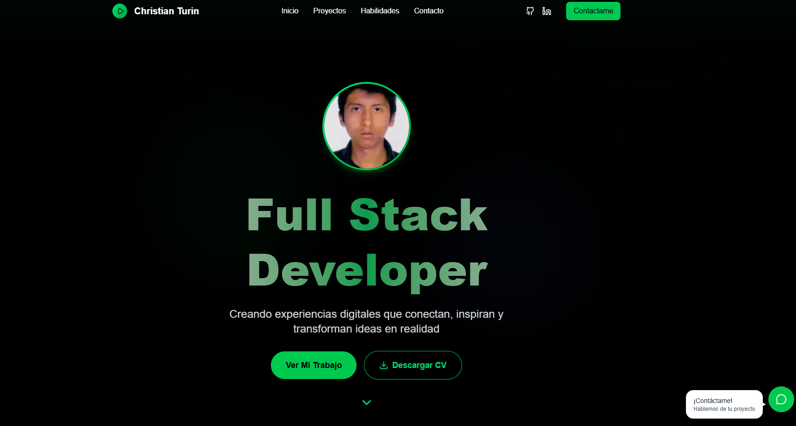

# 🚀 Portfolio Web - Christian Turin

Un portfolio web moderno y dinámico construido con Next.js 14, React 18 y TypeScript, diseñado para mostrar proyectos y habilidades de desarrollo full-stack de manera profesional e interactiva.



## ✨ Características Principales

### 🎨 **Diseño Moderno**
- **Dark Theme**: Interfaz elegante con tema oscuro
- **Glassmorphism**: Efectos de cristal y blur para un look premium
- **Responsive Design**: Perfecto en todos los dispositivos
- **Micro-animaciones**: Transiciones suaves y efectos hover

### 🎭 **Experiencia Interactiva**
- **Typewriter Effect**: Animación de escritura en el hero
- **Scroll Animations**: Elementos que aparecen al hacer scroll
- **Parallax Effects**: Profundidad visual con elementos flotantes
- **Music Player Interface**: Proyectos presentados como playlist

### 📱 **Componentes Avanzados**
- **Header Inteligente**: Con indicador de sección activa
- **Modal de Proyectos**: Vista detallada de cada trabajo
- **Formulario de Contacto**: Con validación y estados de envío
- **WhatsApp Button**: Con tooltip y detección de disponibilidad

### 🔧 **Funcionalidades Técnicas**
- **SSR Compatible**: Sin errores de hidratación
- **TypeScript**: Tipado fuerte en toda la aplicación
- **Performance**: Lazy loading y optimizaciones
- **SEO Friendly**: Metadata y estructura optimizada

## 🛠️ Stack Tecnológico

### **Frontend**
- 
- 
- 
- 

### **Iconos y UI**
- 

### **Herramientas de Desarrollo**
- 
- 

## 🚀 Instalación y Configuración

### Prerrequisitos
- Node.js 18.17+ 
- npm, yarn, pnpm o bun

### 1. Clonar el repositorio
```bash
git clone https://github.com/ChristianTurin/portfolio.git
cd portfolio
```

### 2. Instalar dependencias
```bash
npm install
# o
yarn install
# o
pnpm install
```

### 3. Configurar variables de entorno
```bash
cp .env.example .env.local
```

Edita `.env.local` con tus datos:
```env
NEXT_PUBLIC_EMAIL_SERVICE_ID=tu_service_id
NEXT_PUBLIC_EMAIL_TEMPLATE_ID=tu_template_id
NEXT_PUBLIC_EMAIL_PUBLIC_KEY=tu_public_key
NEXT_PUBLIC_WHATSAPP_NUMBER=51947478972
```

### 4. Ejecutar en desarrollo
```bash
npm run dev
# o
yarn dev
# o
pnpm dev
```

Abre [http://localhost:3000](http://localhost:3000) en tu navegador.

## 📁 Estructura del Proyecto

```
portfolio-web/
├── components/           # Componentes React reutilizables
│   ├── AnimatedDiv.tsx  # Componente para animaciones
│   ├── Header.tsx       # Navegación principal
│   ├── HeroSection.tsx  # Sección de presentación
│   ├── ProjectsSection.tsx # Galería de proyectos
│   ├── ContactSection.tsx  # Formulario de contacto
│   └── WhatsAppButton.tsx  # Botón flotante de WhatsApp
├── data/                # Datos estáticos y configuración
│   └── portfolio.ts     # Datos de proyectos y navegación
├── types/               # Tipos TypeScript
│   └── index.ts         # Interfaces y tipos globales
├── public/              # Archivos estáticos
│   ├── images/          # Imágenes del portfolio
│   └── cv.pdf           # CV descargable
├── app/                 # App Router de Next.js 14
│   ├── layout.tsx       # Layout principal
│   ├── page.tsx         # Página principal
│   └── globals.css      # Estilos globales
└── README.md           # Este archivo
```

## 🎯 Características Detalladas

### Header Inteligente
- **Navegación fluida**: Scroll suave entre secciones
- **Indicador activo**: Muestra la sección actual
- **Responsive menu**: Hamburger menu en móviles
- **CTA destacado**: Botón de contacto prominente

### Hero Section Dinámico
- **Efecto typewriter**: Cambia entre diferentes roles
- **Estadísticas**: Proyectos, clientes, experiencia
- **CTA dual**: Ver trabajo + descargar CV
- **Partículas animadas**: Fondo dinámico sin afectar SSR

### Galería de Proyectos
- **Filtros por tecnología**: Navegación intuitiva
- **Modal detallado**: Vista expandida de cada proyecto
- **Estados de proyecto**: Completado, en progreso, planeado
- **Links funcionales**: GitHub y demo en vivo

### Contacto Profesional
- **Formulario completo**: Datos del proyecto y presupuesto
- **Validación en tiempo real**: Feedback inmediato
- **Múltiples canales**: Email, WhatsApp, LinkedIn
- **FAQ section**: Respuestas a dudas comunes

### WhatsApp Integration
- **Aparición inteligente**: Se muestra después del scroll
- **Detección de horarios**: Indica si estás online
- **Tooltip informativo**: Guía al usuario
- **Analytics tracking**: Mide la efectividad

## 🎨 Personalización

### Colores y Tema
Los colores principales se definen en `tailwind.config.js`:
```javascript
colors: {
  primary: '#10B981',    // Verde principal
  secondary: '#1F2937',  // Gris oscuro
  accent: '#3B82F6',     // Azul de acento
}
```

### Contenido
Edita `data/portfolio.ts` para personalizar:
- Información personal
- Lista de proyectos
- Navegación
- Enlaces sociales

### Animaciones
Las animaciones se controlan en `components/AnimatedDiv.tsx`:
- Direcciones de entrada
- Delays personalizables
- Duración y easing

## 📱 Responsive Design

### Breakpoints
- **Mobile**: < 640px
- **Tablet**: 640px - 1024px
- **Desktop**: > 1024px
- **Large**: > 1280px

### Características Móviles
- Touch-friendly buttons
- Swipe gestures en carousels
- Menú hamburguesa optimizado
- Formularios adaptados

## ⚡ Performance

### Optimizaciones Implementadas
- **Image optimization**: Next.js Image component
- **Lazy loading**: Componentes y imágenes
- **Bundle splitting**: Code splitting automático
- **Static generation**: Pre-renderizado estático

### Métricas Web Vitals
- **LCP**: < 2.5s (Large Contentful Paint)
- **FID**: < 100ms (First Input Delay)
- **CLS**: < 0.1 (Cumulative Layout Shift)

## 🚀 Deployment

### Vercel (Recomendado)
```bash
# Instalar Vercel CLI
npm i -g vercel

# Deploy
vercel

# Deploy a producción
vercel --prod
```

### Netlify
```bash
# Build del proyecto
npm run build

# Subir carpeta .next a Netlify
```

### Variables de Entorno en Producción
Configura las siguientes variables:
- `NEXT_PUBLIC_EMAIL_SERVICE_ID`
- `NEXT_PUBLIC_EMAIL_TEMPLATE_ID`
- `NEXT_PUBLIC_EMAIL_PUBLIC_KEY`
- `NEXT_PUBLIC_WHATSAPP_NUMBER`

## 🔄 Scripts Disponibles

```bash
npm run dev          # Desarrollo
npm run build        # Build de producción
npm run start        # Ejecutar build
npm run lint         # Linting con ESLint
npm run lint:fix     # Fix automático de linting
npm run type-check   # Verificación de tipos
```

## 🤝 Contribuir

1. Fork del proyecto
2. Crea una rama para tu feature (`git checkout -b feature/amazing-feature`)
3. Commit tus cambios (`git commit -m 'Add amazing feature'`)
4. Push a la rama (`git push origin feature/amazing-feature`)
5. Abre un Pull Request

## 📄 Licencia

Este proyecto está bajo la Licencia MIT - ver el archivo [LICENSE](LICENSE) para más detalles.

## 👤 Autor

**Christian Turin**
- GitHub: [@ChristianTurin](https://github.com/ChristianTurin)
- LinkedIn: [Christian Turin](https://linkedin.com/in/christian-turin-49186b2b5)
- Email: iiuknown@gmail.com
- WhatsApp: [+51 947 478 972](https://wa.me/51947478972)

## 🙏 Agradecimientos

- [Next.js](https://nextjs.org/) por el framework
- [Tailwind CSS](https://tailwindcss.com/) por el sistema de diseño
- [Lucide](https://lucide.dev/) por los iconos
- [Vercel](https://vercel.com/) por el hosting

---

<div align="center">

**⭐ ¡Dale una estrella si te gustó el proyecto! ⭐**

[Demo en Vivo](https://kaiserdevs.com) • [Reportar Bug](https://github.com/ChristianTurin/portfolio/issues) • [Solicitar Feature](https://github.com/ChristianTurin/portfolio/issues)

</div>
